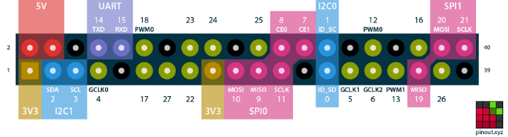
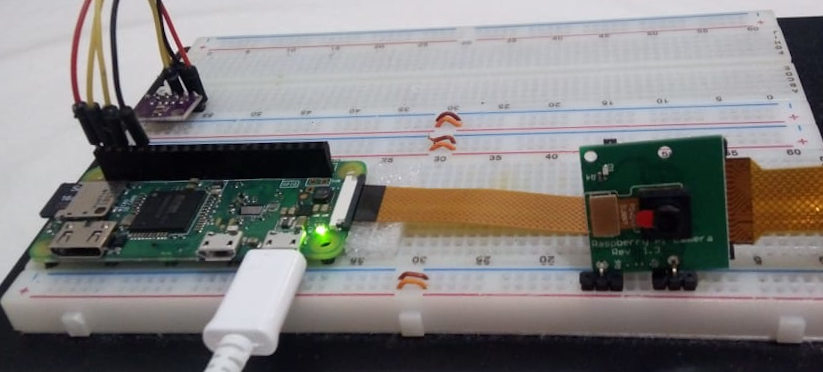

This project is a team effort for NASA's hackaton (A World Away section) to identify pandemic social problems that may have collateral effects in remote locations (such as space). How will you prepare for the collateral effects in remote locations, and/or evaluate on-Earth support and remote location risks, including psychological and technical risks?
https://covid19.spaceappschallenge.org/challenges/covid-challenges/world-away/teams/gagarin/project

# gagarin-firmware

Minimum Viable Product of the Gagarin team

Uses a raspberry pi zero w, the sensor bme280 (temperature and humidity and pressure), and a video camera

# Raspberry pi zero w

Have wifi and bluetooth

Have enough processing power to a run an object detector or a simple neural network

Pinout:

The sensor is connected in GPIO 2 and 3, and the camera in the only CSI connector

